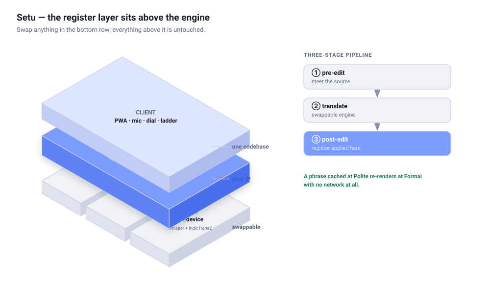
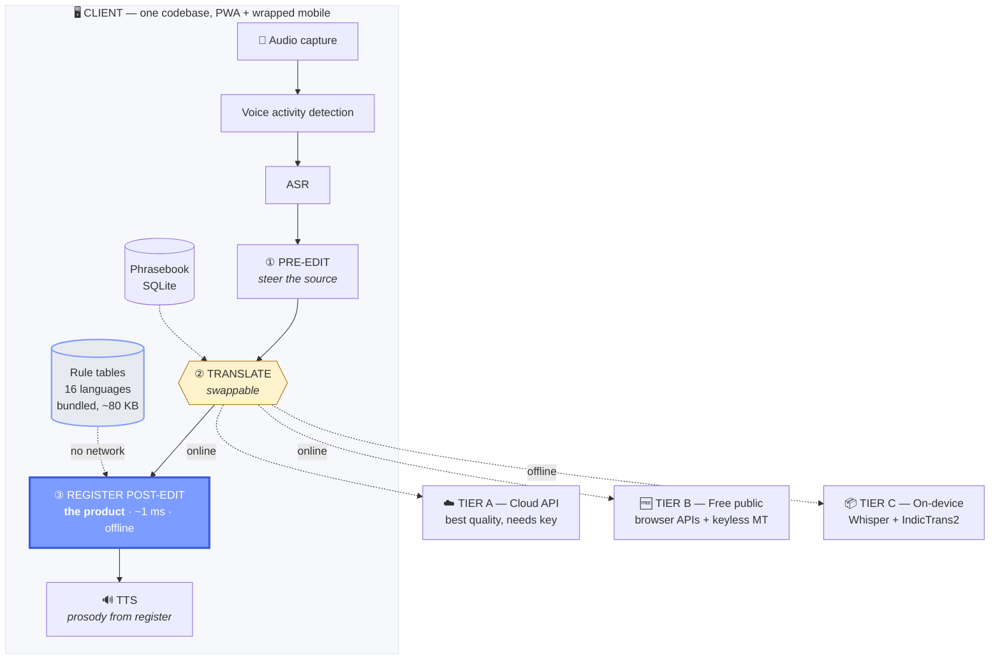
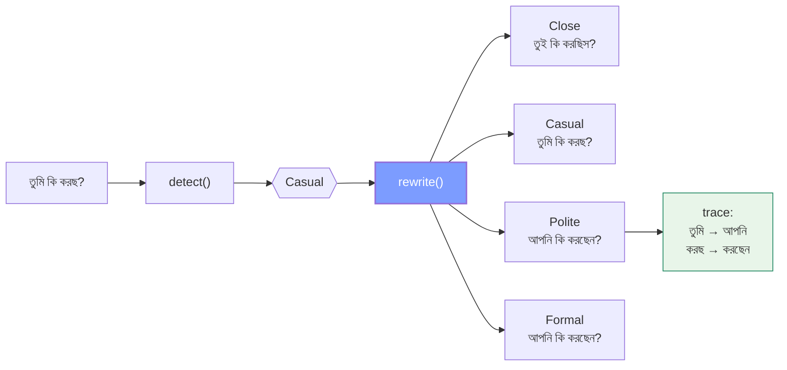
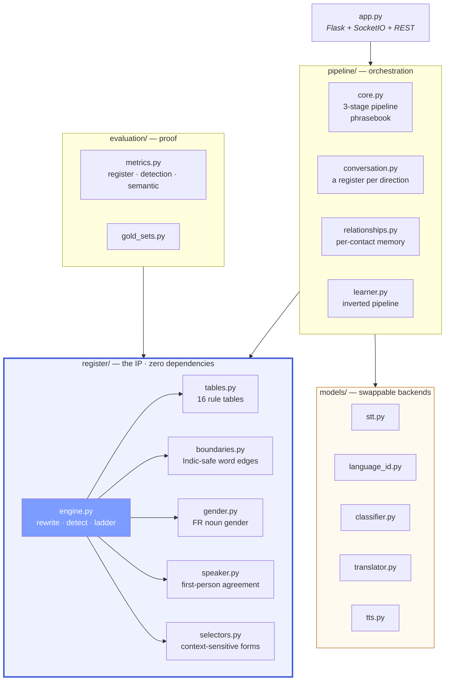

# Setu — Real-Time Formality-Aware Speech-to-Speech Translation

Every speech translator answers *"what did they say?"* None of them answer
*"how did they say it — and how should I say it back?"*

In Bengali, saying **তুই** to your future father-in-law is an insult. Saying
**আপনি** to your best friend is cold. Hindi has तू / तुम / आप, Tamil நீ / நீங்கள்,
German du / Sie, French tu / vous. General-purpose engines collapse all of this
into one arbitrary choice, and for Indic languages they usually pick the
*informal* form — so a tourist asking an elderly shopkeeper for directions comes
out sounding like they are talking to a child.

**Setu treats register as a first-class control, not a side effect.** You get a
dial. The machine reads the register the speaker used and can mirror it. Every
translation shows which register it landed in and exactly what it changed.

---

## Quick start

```bash
python -m venv .venv
```

```bash
.venv\Scripts\activate
```

```bash
pip install -r requirements.txt
```

```bash
python app.py
```

Then open <http://localhost:5000>. Speech in and speech out use the browser's
own APIs — no API key, no cost.

---

## How it fits together

The whole design rests on one decision: **the register layer sits above the
translation engine, not inside it.** Everything else follows from that — the
engine is swappable, re-levelling needs no network, and the layer can be lifted
out and sold to anyone already doing translation.

<p align="center">
  <picture>
    <source media="(prefers-color-scheme: dark)" srcset="docs/architecture-dark.svg">
    
  </picture>
</p>

The wide slab is the point. It spans all three engine tiers rather than sitting
inside any of them, so swapping what is underneath changes nothing above it.
Regenerate with `python docs/make_diagrams.py`.



**Fallback chain:** cached phrase → on-device model → premium API → free
endpoint → *"I couldn't translate that, here's what I heard."* The user never
sees a dead end.

### The layer that makes it different



One symmetric dataset drives all three jobs — **upgrade, downgrade, detect** —
because every rule is the same thing said four ways.

### Module structure



Note the dependency direction: `register/` depends on **nothing**. That is what
lets it work offline, run in ~1 ms, and be lifted out as a component.

---

## What's here

| Path | What it is |
|---|---|
| `register/` | **The register engine.** Rule tables for 16 languages, plus rewrite / detect / ladder, noun gender, speaker agreement. Zero dependencies, works offline, ~1 ms. |
| `pipeline/` | Three-stage pipeline, phrasebook cache, asymmetric conversations, relationship memory, learner mode. |
| `models/` | Swappable backends: STT, language ID, formality classification, MT, TTS. |
| `data_preprocessing/` | Builds train/val/test splits from the FAME-MT corpus. |
| `classifier/` | Fine-tunes a formality classifier on those splits. |
| `evaluation/` | The three metrics that make the claim defensible. |
| `tests/` | 255 tests. |
| `app.py` | Flask + SocketIO server and REST API. |

---

## The register model

Four levels on one scale:

| Level | Bengali | Hindi | Tamil | German | Japanese |
|---|---|---|---|---|---|
| 0 Close | তুই | तू | நீ | du | plain |
| 1 Casual | তুমি | तुम | நீ | du | plain |
| 2 Polite | আপনি | आप | நீங்கள் | Sie | です・ます |
| 3 Formal | আপনি | आप | நீங்கள் | Sie | 敬語 |

Not every language fills all four slots. Each table carries a `canon` map that
folds a requested level onto the nearest one the language actually realises, so
German `du` reports as *Casual*, not *Close*.

Every rule is a **4-tuple of equivalent surface forms**, one per level. Because
the table is symmetric, one dataset drives three jobs — upgrading, downgrading,
and detection:

```python
from register import rewrite, detect, ladder, POLITE, CLOSE

rewrite("তুমি কি করছ?", "bn", POLITE).text
# 'আপনি কি করছেন?'

detect("আপনি কেমন আছেন?", "bn").level
# 2  (Polite)

for level, result in ladder("তুমি কি করছ?", "bn").items():
    print(result.text)
# তুই কি করছিস?  /  তুমি কি করছ?  /  আপনি কি করছেন?  /  আপনি কি করছেন?
```

Adding a language means adding a table, not writing code.

### Why post-editing rather than prompting an LLM to "be formal"

It is free, instant, offline-capable and *auditable* — you can show the user
exactly what changed. An LLM prompt gives none of those four properties and will
silently drift.

```python
result = rewrite("Können Sie mir Ihr Buch geben?", "de", CLOSE)
result.text                      # 'Kannst du mir dein Buch geben?'
[e.describe() for e in result.edits]
# ['Können Sie → Kannst du  (clause.koennen.inv)', 'Ihr → dein  (poss.nom.m)']
```

### Handling the hard parts

The tables carry contextual guards, because several languages spell different
things the same way:

- German `Sie sind` is *you*, `Sie ist` is *she* — only the verb tells them apart.
- German `Ich sehe Sie` is accusative (→ `dich`), not nominative (→ `du`).
- French `vous êtes` is a subject, `je vous vois` an object clitic, `pour vous`
  tonic — three different targets, decided by the left context.
- Italian `ha` is both polite *you have* and *he/she has*.
- Gujarati `આપ` is both the formal pronoun *you* and the imperative *give!*
- Bengali spells *you say* and *say!* identically as `বলো`.

Pronouns and verbs move together, so `Sie sind sehr nett` becomes
`Du bist sehr nett` and never `Du sind sehr nett`.

**Known limitation:** Italian sentence-initial `Lei` is irreducibly ambiguous —
polite *you* and *she* both capitalise there and both take third-person verbs.
The engine reads it as polite. Mid-sentence casing is handled correctly.

---

## Things no other translation product does

### Conversations are asymmetric

Your uncle says তুই to you. You say আপনি back. Both are correct, and neither is
the other's mirror — this is how most Indian conversations across a generation
gap actually work. Every product on the market applies one register to a whole
session and gets this exactly wrong.

```python
from pipeline import Conversation, Participant
from register import AUTO, POLITE

uncle = Participant("uncle", "bn", register=AUTO)               # speaks down
you   = Participant("you", "bn", register=POLITE,               # speaks up
                    addressee="elder_man")

convo = Conversation(uncle, you)
convo.say("uncle", "তুই কোথায় যাস?")
convo.say("you",   "তুমি কেমন আছ?")     # → "কাকু, আপনি কেমন আছেন?"

convo.is_asymmetric()          # True
convo.observed_registers()     # {'uncle': 0, 'you': 1}
```

The vocative — কাকু — is inserted automatically. English has no such slot, so
MT either drops it (sounding abrupt) or emits a stiff "sir" nobody says.

### Register attached to a person

```python
from pipeline import RelationshipBook

book = RelationshipBook()
book.remember("Rahul's father", language="bn",
              register=POLITE, addressee="elder_man")
```

The second conversation needs no configuration. Nobody else has this — not
because it is hard, but because you cannot attach a register to a contact until
register is a first-class object. This data never leaves the device: local
SQLite, no sync, no export endpoint.

### Learner mode — the pipeline run backwards

Duolingo teaches vocabulary and grammar. None of them teach *register*, which
is what actually determines whether a learner sounds rude.

```python
from pipeline import assess

assess("তুই কেমন আছিস?", "bn", "stranger").message
# 'You used Close with someone you have just met. That will sound too
#  familiar — native speakers would use Polite here.'
```

It accepts more than one answer where the language genuinely does. Family
elders are the contested case — high respect *and* high closeness — so both
তুমি and আপনি pass, because insisting on one would teach something false.

### Gender that MT throws away

`votre` carries no gender, so downgrading it has to guess — and every engine
guesses masculine, producing the wrong *ton maison*:

| | |
|---|---|
| `votre maison` → | `ta maison` (feminine noun) |
| `votre livre` → | `ton livre` (masculine noun) |
| `votre amie` → | `ton amie` (feminine, but vowel-initial) |

And in Hindi, Marathi, Punjabi and Gujarati the verb agrees with **who is
speaking**, so MT's masculine default misgenders half its users:

```python
rewrite("मैं काम करता हूँ", "hi", CASUAL, speaker_gender="female").text
# 'मैं काम करती हूँ'
```

Only first-person sentences are touched — Hindi has ordinary nouns ending in
ता (पिता, माता, नेता) and rewriting those would be far worse than leaving a
verb masculine.

---

## Offline

The register layer is pure client-side string processing, which gives it a
property no engine-integrated approach has: **a phrase cached at Polite can be
re-rendered at Formal with no network at all.**

- A service worker caches the app shell, so the app opens with no connection.
- Every translation is written to a phrasebook keyed by source → target → text,
  *not* by register — so one cached MT output serves all four levels.
- Repeats are free, which also makes the online experience faster.

```bash
SETU_ALLOW_NETWORK=0 python app.py
```

---

## Preparing data and training

The corpus is FAME-MT: parallel formal/informal pairs across 15 European
languages, under `data/dataset/`.

```bash
python -m data_preprocessing.build_splits
```

Streams ~11.2M rows and writes `data/splits/{train,val,test}.tsv` with a header.
Split assignment is a stable hash of the row, so it needs no shuffle buffer and
re-runs produce byte-identical splits. Rows then pass through a bounded shuffle
buffer on the way out, so any *prefix* of the output is a fair mix — without it
the head of `train.tsv` is one language pair and one class, and `--max-rows`
cannot train at all.

```bash
python -m data_preprocessing.build_splits --max-rows-per-file 5000
```

Then, with the training extras installed:

```bash
pip install -r requirements-train.txt
```

```bash
python -m classifier.train --max-rows 200000 --epochs 2
```

The device is configured from the card that is actually present: bf16 where
supported (same exponent range as fp32, so no loss scaling and no silent
overflow to NaN partway through a long run), TF32 matmul, and a batch size
sized to available VRAM.

**On a new GPU, check the wheel first.** A PyTorch build only ships kernels for
the architectures it was compiled for, and `torch.cuda.is_available()` returns
True on a card it cannot actually run — you get *"no kernel image is available
for execution on the device"* at the first forward pass, possibly an hour in.
The script checks the architecture up front and refuses to start, printing the
fix. For Blackwell (RTX 50-series, `sm_120`) that is:

```bash
pip install --force-reinstall torch --index-url https://download.pytorch.org/whl/cu128
```

Verified on an RTX 5070 Ti Laptop (12 GB, compute 12.0): 368 samples/s at
batch 32, bf16.

> **Note on labels.** The filename is ground truth. Slang detection is recorded
> as a *feature column*, not a label override — overriding is opt-in behind
> `--slang-overrides-label`, because doing it by default is what corrupted the
> previous splits.

---

## Measuring it

Three metrics, tracked separately:

| Metric | Question |
|---|---|
| Register accuracy | Of translations requested at level N, what fraction land at level N? |
| Detection accuracy | When the speaker used আপনি, does Auto report Polite? |
| Semantic preservation | Did the register rewrite break the meaning? |

The third is the one that will bite you — a sentence can be perfectly Polite and
also nonsense, and the first two metrics cannot see it.

```bash
python -m evaluation.run
```

```bash
python -m evaluation.run --lang bn --verbose --fail-under 0.9
```

Gold sets live in `data/gold/<lang>.jsonl`, one JSON object per line:

```json
{"text": "আপনি কেমন আছেন?", "level": 2, "note": "greeting, stranger"}
```

```bash
python -m evaluation.run --write-template bn
```

All 16 tables are now measured and pass at 100% on the seed cases. That is a
regression net, **not a benchmark** — the seed set is a few sentences per
language, and the harness says so on every run rather than reporting a
flattering number over nothing.

Making it a benchmark is the highest-leverage work left. CoCoA-MT gave Hindi a
*binary* formality benchmark in 2022; Bengali — 228 million speakers, three
grammatical registers — has nothing, and nor does Tamil, Telugu, Kannada,
Malayalam, Gujarati, Marathi, Punjabi, Odia or Assamese. A few hundred
annotated sentences per language is a few weeks and a few thousand rupees, and
it is the one asset a well-funded competitor cannot shortcut.

---

## Tests

```bash
python -m pytest tests/ -q
```

255 tests covering the rule tables, round-trip stability, third-person safety,
Indic boundary handling, French noun gender, speaker agreement, asymmetric
conversations, learner feedback, the slang-detection regressions, and the
pipeline with networking disabled.

---

## Configuration

| Variable | Default | Meaning |
|---|---|---|
| `SETU_HOST` | `127.0.0.1` | Bind address |
| `SETU_PORT` | `5000` | Port |
| `SETU_DEBUG` | off | Reloader and verbose errors |
| `SETU_ALLOW_NETWORK` | `1` | Set `0` to forbid outbound calls |
| `SETU_WHISPER_MODEL` | `base` | Whisper size when server-side ASR is installed |
| `SETU_MT_TIMEOUT` | `6` | Seconds before the MT endpoint is abandoned |

## API

| Endpoint | Purpose |
|---|---|
| `POST /api/translate` | Full pipeline. Returns text, register, edits, ladder, timings. |
| `POST /api/relevel` | Re-render existing text at another register. No MT call. |
| `POST /api/detect` | Read the register of a sentence. |
| `GET /api/languages` | Tables, levels, rule counts, address terms. |
| `GET /api/health` | Which backends are actually available. |
| `POST /api/conversation` | Start a two-party conversation with a register per direction. |
| `POST /api/conversation/<id>/say` | One turn, translated at the *speaker's* register. |
| `POST /api/learner/assess` | Judge a learner's sentence against who they are addressing. |
| `GET/POST /api/relationships` | Per-contact register memory (on-device). |

```bash
curl -s localhost:5000/api/translate -H 'Content-Type: application/json' -d '{"text":"Can you give me your book?","source_lang":"en","target_lang":"bn","register":"polite"}'
```

---

## Caveats worth knowing

- **The keyless MT endpoint is undocumented.** Fine for a prototype and a free
  tier; it can rate-limit or change shape without notice. Move to Sarvam or
  Bhashini before charging anyone.
- **iOS Safari speech recognition is weaker than Chrome's.** You will likely need
  to route ASR through a cloud API there. Budget for it now.
- **Register is culturally contested.** Two native speakers will disagree about
  whether a sentence is Polite or Formal, and regional variation is real
  (Kolkata vs Dhaka Bengali). The dial exists precisely because there is no
  single correct answer.

---

*Setu (সেতু) — "bridge." A bridge carries you across, but it also decides how
you arrive.*
